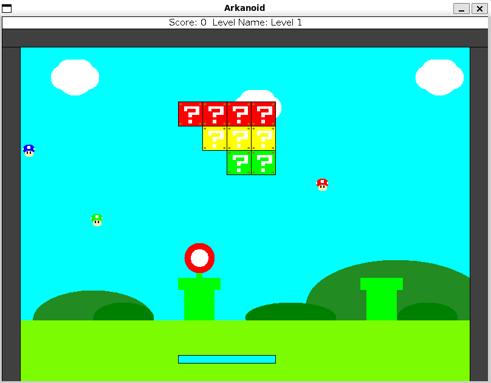
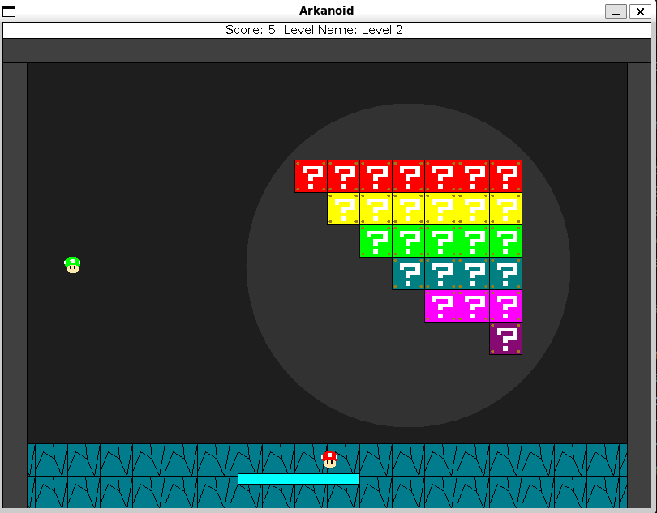
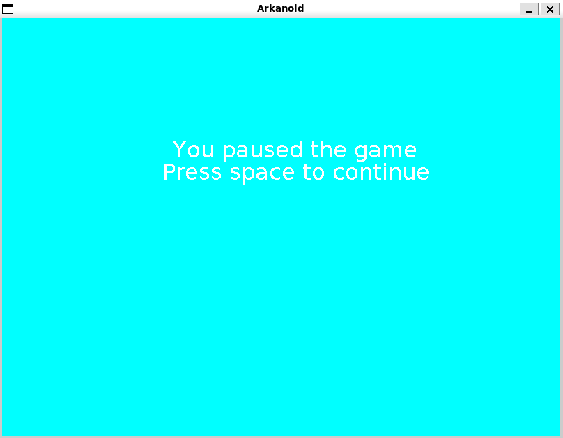
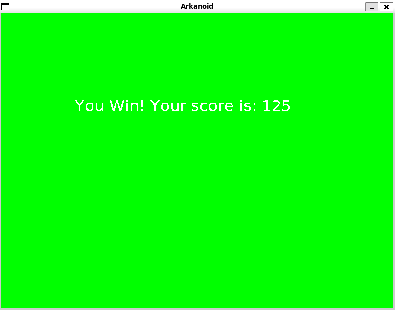
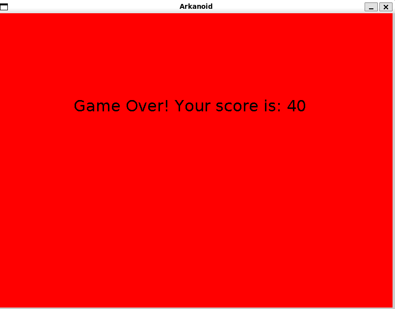

# Mario-Arkanoid
An Arkanoid game with the design of the Mario games programmed in Java.

## Features
- Two levels
- Pause Menu
- Surprises Blocks
- Retro-Graphics
- Score

## How To Run The Game
- Make sure you have JDK 17 or higher installed
- Clone the repository with the command ```git clone https://github.com/elinab26/Mario-Arkanoid``` 
- Open the directory `Mario-Arkanoid` in your terminal
- Compile the project with the next commande: ```javac -cp "biuoop-1.4.jar:src" -d bin src/**/*.java src/Sprites/Backgrounds/*.java src/ArkanoidGame.java```
- And run with ```java -cp "biuoop-1.4.jar:bin" ArkanoidGame```
- Now the game is running, use the arrows to move the paddle.
- To open the Pause Menu, press `p`

## Screenshots






## Project Structure
├── Mario Arkanoid.iml
├── biuoop-1.4.jar
└── src
    ├── Animations
    │   ├── Animation.java
    │   ├── AnimationRunner.java
    │   └── CountdownAnimation.java
    ├── ArkanoidGame.java
    ├── Collidables
    │   ├── Collidable.java
    │   └── CollisionInfo.java
    ├── Geometry
    │   ├── Line.java
    │   ├── Point.java
    │   └── Rectangle.java
    ├── Level
    │   ├── Counter.java
    │   ├── GameEnvironment.java
    │   ├── GameFlow.java
    │   ├── LevelInformation.java
    │   └── ScoreTrackingListener.java
    ├── ListenersAndNotifier
    │   ├── BallRemover.java
    │   ├── BlockRemover.java
    │   ├── HitListener.java
    │   └── HitNotifier.java
    ├── Screens
    │   ├── GameLevel.java
    │   ├── GameOver.java
    │   ├── Level1.java
    │   ├── Level2.java
    │   ├── PauseScreen.java
    │   └── Win.java
    └── Sprites
        ├── Backgrounds
        │   ├── Background.java
        │   ├── Background1.java
        │   └── Background2.java
        ├── Ball.java
        ├── Block.java
        ├── Paddle.java
        ├── ScoreIndicator.java
        ├── Sprite.java
        ├── SpriteCollection.java
        └── Velocity.java